# 🔧 Deployment Fix Guide - CORS & Login Issues

## 🎯 Your Current Issues:

1. ✅ Backend works (health check + registration via PowerShell)
2. ❌ CORS headers are NULL (blocking browser requests)
3. ❌ Frontend can't login/register (due to CORS)

---

## 📋 **FIX CHECKLIST**

### **Step 1: Verify ALLOWED_ORIGINS on Render** ⚠️ CRITICAL

1. Go to: https://dashboard.render.com
2. Click your backend service: `ansora-mvp`
3. Click **"Environment"** tab
4. Look for `ALLOWED_ORIGINS`

**What you should see:**
```
ALLOWED_ORIGINS = *
```

**If it's missing or empty:**
- Click **"Add Environment Variable"**
- Key: `ALLOWED_ORIGINS`
- Value: `*`
- Click **"Save"**

---

### **Step 2: Manual Redeploy** ⚠️ REQUIRED

Even if you set `ALLOWED_ORIGINS`, Render might not have redeployed automatically!

**Force a manual redeploy:**

1. Stay in Render Dashboard → Your service
2. Click **"Manual Deploy"** button (top right)
3. Select **"Deploy latest commit"**
4. Click **"Deploy"**
5. **WAIT 3-5 minutes** - Watch the logs until you see:
   ```
   INFO:     Application startup complete.
   ```

---

### **Step 3: Verify CORS is Fixed**

After redeploy completes:

1. Run this PowerShell command:
```powershell
cd C:\Projects\MVP_Marketing\mvp_marketing_app
powershell -ExecutionPolicy Bypass -File check_cors.ps1
```

**Expected output:**
```
✅ Access-Control-Allow-Origin : *
✅ CORS is configured!
```

**If still NOT FOUND:** The environment variable wasn't picked up. Go back to Step 1.

---

### **Step 4: Set Frontend Environment Variable on Vercel**

1. Go to: https://vercel.com/dashboard
2. Select your frontend project
3. Click **"Settings"**
4. Click **"Environment Variables"**
5. Look for `NEXT_PUBLIC_BACKEND_URL`

**If missing or wrong:**
- Click **"Add"**
- Key: `NEXT_PUBLIC_BACKEND_URL`
- Value: `https://ansora-mvp.onrender.com`
- Select: ✅ Production, ✅ Preview, ✅ Development
- Click **"Save"**

---

### **Step 5: Redeploy Frontend on Vercel**

1. Vercel Dashboard → Your project
2. Click **"Deployments"** tab
3. Click **"..."** on latest deployment
4. Click **"Redeploy"**
5. Click **"Redeploy"** to confirm

**WAIT 2-3 minutes** for deployment to complete.

---

## 🧪 **Testing After Fixes**

### **Test 1: CORS Check (Local)**
```powershell
powershell -ExecutionPolicy Bypass -File check_cors.ps1
```
Expected: ✅ CORS headers found

### **Test 2: Registration via HTML Tool**
1. Open `test_deployment.html`
2. Enter backend URL: `https://ansora-mvp.onrender.com`
3. Click "Save URL"
4. Click "Test CORS"
   - Expected: ✅ CORS WORKING!
5. Click "Register" (with test@example.com)
   - Expected: ✅ REGISTRATION SUCCESS!

### **Test 3: Frontend Login**
1. Go to your Vercel URL (e.g., `https://your-app.vercel.app`)
2. Open DevTools (F12) → Console tab
3. Try to register a new user
4. Check Console for errors

**If you see CORS error:**
- Backend `ALLOWED_ORIGINS` needs your Vercel URL
- Update to: `*,https://your-vercel-url.vercel.app`

**If you see "Failed to fetch":**
- Check `NEXT_PUBLIC_BACKEND_URL` is set correctly
- Should be: `https://ansora-mvp.onrender.com` (no trailing slash!)

---

## 🔍 **Common Mistakes**

### ❌ Mistake 1: Not redeploying
**Problem:** You set environment variable but didn't redeploy
**Fix:** Always manually redeploy after changing environment variables

### ❌ Mistake 2: Trailing slash in URLs
**Problem:** `https://ansora-mvp.onrender.com/` (with slash)
**Fix:** Remove trailing slash: `https://ansora-mvp.onrender.com`

### ❌ Mistake 3: Wrong Vercel URL
**Problem:** Using preview URL instead of production URL
**Fix:** Use the main production domain from Vercel → Domains

### ❌ Mistake 4: Not waiting for deployment
**Problem:** Testing immediately after clicking deploy
**Fix:** Wait for "Application startup complete" in logs

---

## 📊 **Environment Variables Summary**

### **Render (Backend) - REQUIRED:**
```bash
# CRITICAL for CORS
ALLOWED_ORIGINS=*

# Required for app to work
JWT_SECRET=your-secret-key-32-chars-minimum
OPENAI_API_KEY=sk-your-openai-key
QDRANT_URL=https://c4c03fda-2e4b-45d9-bf2f-e442ba883e0b.eu-west-1-0.aws.cloud.qdrant.io:6333
QDRANT_API_KEY=your-qdrant-api-key
CLOUD_QDRANT_URL=https://c4c03fda-2e4b-45d9-bf2f-e442ba883e0b.eu-west-1-0.aws.cloud.qdrant.io:6333
CLOUD_QDRANT_API_KEY=your-cloud-api-key
STORAGE_PATH=/app/storage
```

### **Vercel (Frontend) - REQUIRED:**
```bash
# CRITICAL - Must point to your backend
NEXT_PUBLIC_BACKEND_URL=https://ansora-mvp.onrender.com
```

---

## 🚨 **If Still Not Working**

### **1. Check Render Logs:**
```
Render Dashboard → Your service → Logs tab
```
Look for:
- ✅ "Application startup complete"
- ❌ Any ERROR messages
- ❌ "ALLOWED_ORIGINS not set" warnings

### **2. Check Vercel Build Logs:**
```
Vercel Dashboard → Deployments → Click latest → View Logs
```
Look for:
- ✅ "Build succeeded"
- ❌ Missing environment variables warnings

### **3. Check Browser Console:**
```
Your Vercel site → F12 → Console tab
```
Look for:
- ❌ "CORS policy" errors → Backend ALLOWED_ORIGINS issue
- ❌ "Failed to fetch" → Wrong backend URL
- ❌ "NetworkError" → Backend down or wrong URL

---

## ✅ **Success Indicators**

You'll know it's working when:

1. **PowerShell check shows:**
   ```
   ✅ Access-Control-Allow-Origin : *
   ✅ CORS is configured!
   ```

2. **HTML test tool shows:**
   ```
   ✅ CORS WORKING!
   ✅ REGISTRATION SUCCESS!
   ✅ LOGIN SUCCESS!
   ```

3. **Frontend (Vercel) works:**
   - ✅ No CORS errors in console
   - ✅ Registration redirects to dashboard
   - ✅ Login works
   - ✅ Can see user email in navbar

---

## 📞 **Get Help**

If you're still stuck after following all steps, provide:

1. **Render Environment Variables:**
   - Screenshot of Environment tab showing ALLOWED_ORIGINS

2. **Render Logs:**
   - Last 20 lines from Logs tab

3. **Vercel Environment Variables:**
   - Screenshot showing NEXT_PUBLIC_BACKEND_URL

4. **Browser Console Error:**
   - Full error message from F12 console

5. **PowerShell CORS check output:**
   - Result of running check_cors.ps1

---

## 🎯 **Quick Reference Commands**

```powershell
# Check CORS headers
cd C:\Projects\MVP_Marketing\mvp_marketing_app
powershell -ExecutionPolicy Bypass -File check_cors.ps1

# Test registration directly (bypasses CORS)
Invoke-RestMethod -Uri "https://ansora-mvp.onrender.com/api/v1/auth/register" -Method POST -ContentType "application/json" -Body '{"email":"test@example.com","password":"test12345","is_subscribed":false}'

# Test login directly (bypasses CORS)
Invoke-RestMethod -Uri "https://ansora-mvp.onrender.com/api/v1/auth/login" -Method POST -ContentType "application/json" -Body '{"email":"test@example.com","password":"test12345"}'
```

---

## 🔄 **Standard Fix Flow**

```mermaid
graph TD
    A[Set ALLOWED_ORIGINS=* on Render] --> B[Manual Redeploy Backend]
    B --> C[Wait 3-5 min for deploy]
    C --> D[Run check_cors.ps1]
    D --> E{CORS headers found?}
    E -->|Yes| F[Set NEXT_PUBLIC_BACKEND_URL on Vercel]
    E -->|No| A
    F --> G[Redeploy Frontend on Vercel]
    G --> H[Wait 2-3 min]
    H --> I[Test login on frontend]
    I --> J{Works?}
    J -->|Yes| K[✅ SUCCESS!]
    J -->|No| L[Check browser console]
    L --> M[Debug specific error]
```



---

**START HERE:**
1. ✅ Verify `ALLOWED_ORIGINS=*` on Render
2. ✅ Manual redeploy backend
3. ✅ Run `check_cors.ps1`
4. ✅ Set `NEXT_PUBLIC_BACKEND_URL` on Vercel
5. ✅ Redeploy frontend
6. ✅ Test!

**Good luck!** 🚀

